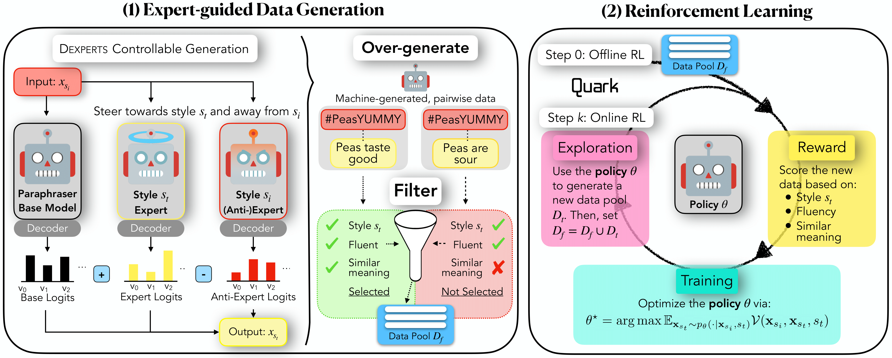

# STEERStyleTransfer

This is the repository for the 2023 EMNLP Findings Paper, ["🐂 STEER: Unified Style Transfer with Expert Reinforcement"](https://arxiv.org/abs/2311.07167)

<p align="center">
  
</p>


# Getting Started

## Setting up the Environment
To set up the environment to run the code, make sure to have conda installed, then run

```
conda env create -f environment.yml
```
Then, activate the environment:

```
conda activate style
```

## Compute Requirements

## Training

To train, we can run the following command:

```
# For a100, 200k
python3 main.py \
    --precomputed_dataset_dir hallisky/STEER-data-top-400k-combo \
    --n_extra_tokens 5 \
    --init_model models/paraphraser_gpt2_large \
    --ref_model models/paraphraser_gpt2_large \
    --temperature 1.0 \
    --reward_model_dir hallisky/cds_style_classifier \
    --batch_size 300 \
    --dataset_partition 10 \
    --num_examples_val 100 \
    --num_examples_train 1000 \
    --total_episodes 20000000 \
    --lr 5e-4 \
    --num_warmup_steps 500 \
    --max_gen_length 50 \
    --top_p 0.9 \
    --sample_interval 2500 \
    --save_interval 100 \
    --eval_interval 100 \
    --kl_coef 0.0 \
    --entropy_coef 0.0 \
    --no_repeat_ngrams 0 \
    --multiple_reward_tokens \
    --save_naming product_5e-4_p0.9_800k_bs128_multi \
```

# Citing this work
If you use/reference this work, please cite us with:

```
@inproceedings{hallinan-etal-2023-steer,
    title = "{STEER}: Unified Style Transfer with Expert Reinforcement",
    author = "Hallinan, Skyler  and
      Brahman, Faeze  and
      Lu, Ximing  and
      Jung, Jaehun  and
      Welleck, Sean  and
      Choi, Yejin",
    editor = "Bouamor, Houda  and
      Pino, Juan  and
      Bali, Kalika",
    booktitle = "Findings of the Association for Computational Linguistics: EMNLP 2023",
    month = dec,
    year = "2023",
    address = "Singapore",
    publisher = "Association for Computational Linguistics",
    url = "https://aclanthology.org/2023.findings-emnlp.506",
    doi = "10.18653/v1/2023.findings-emnlp.506",
    pages = "7546--7562",
    abstract = "While text style transfer has many applications across natural language processing, the core premise of transferring from a single source style is unrealistic in a real-world setting. In this work, we focus on arbitrary style transfer: rewriting a text from an arbitrary, unknown style to a target style. We propose STEER: Unified Style Transfer with Expert Reinforcement, a unified frame-work developed to overcome the challenge of limited parallel data for style transfer. STEER involves automatically generating a corpus of style-transfer pairs using a product of experts during decoding. The generated offline data is then used to pre-train an initial policy before switching to online, off-policy reinforcement learning for further improvements via fine-grained reward signals. STEER is unified and can transfer to multiple target styles from an arbitrary, unknown source style, making it particularly flexible and efficient. Experimental results on a challenging dataset with text from a diverse set of styles demonstrate state-of-the-art results compared to competitive baselines. Remarkably, STEER outperforms the 175B parameter instruction-tuned GPT-3 on overall style transfer quality, despite being 226 times smaller in size. We also show STEER is robust, maintaining its style transfer capabilities on out-of-domain data, and surpassing nearly all baselines across various styles. The success of our method highlights the potential of RL algorithms when augmented with controllable decoding to overcome the challenge of limited data supervision.",
}
```